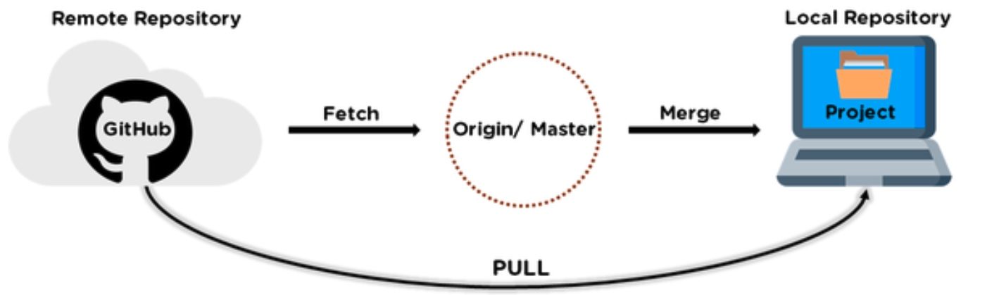

# 算法笔记
git add -A 所有的文件提交到缓存区

## 第八章
### DFS
常见的DFS问题的解决办法，给定一个序列，枚举所有序列的所有子序列。也等价于枚举从N个整数中选K个数，使得满足一定特征。
考虑：递归，岔路口是什么，死胡同是什么条件，选/不选。
### BFS
以广度为第一优先级，当碰到岔路口，总是依次访问从该岔道口能直接到的所有节点，再按这些节点被访问的顺序去依次访问它们能直接到达的所有节点。

用队列，模板。
>
```
void BFS（int s){
    queue<int> q;
    q.push(s);
    while(!q.empty()){
        取出队首元素top；
        访问队首元素top；
        将队首元素出队；
        将top的下一层结点中未曾入队的结点全部入队，并设置为已入队。
    }
}
```

##第九章
### 树的基本知识点
### 树的遍历，不仅限于二叉树
注意树的建立
>
```
struct tree{
	int data;
	int weight;
	vector<int> child;
}Node[maxn];
```
记得对树的结点的遍历，
普通的树的遍历:
>先序遍历——DFS
>层次遍历——BFS
> 
```
for(int i = 0 ; i < Node[root].child.size() ; i++){
		dfs(Node[root].child[i]);	
	}
```
### 二叉查找树 BST
核心:给你序列，如何构造一个二叉排序树。典型A1043
二叉排序树最重要的性质：**中序遍历的值是递增的。**
>
```
//记得这里要引用，&root，因为涉及到了修改
struct node{
    int data;
    node* lchild;
    node* rchild;
};
void insert( node* &root , int x){
	if(root == NULL){
		root = new node;
		root->data = x;
		root->lchild = root->rchild = NULL;
		return ;
	}
	if(x >= root->data) {
		insert(root->rchild , x);
	}else {
		insert(root->lchild ,  x);
	}
}
int main(){
    node root = NULL;   //记得这里要是空节点，一开始写的是node* root = new Node；就不对
}
```
还有A1064，告诉我，完全二叉树可以直接用一个数组构造出来，利用下标可以找到左右孩子（2n和2n+1），数组的值代表树节点的值。

### 平衡树
A1066已经列举了所有基本的函数操作。核心在insert函数里面。
写的时候注意，`root==NULL？？`
类型判断如下：左旋和右旋的代码+下表

| root的平衡因子 | root->lchild/root->rchild | 类型 |
|----------------|---------------------------|------|
| 2              | 1                         | LL   |
| 2              | -1                        | LR   |
| -2             | 1                         | RL   |
| -2             | -1                        | RR   |


### 并查集
基本函数
>`令father[i] = 1 //初始化`
`int findFather(int x)  //寻找跟节点`
`void Union(int a, int b) //把两个集合合并`


### 堆
堆比较重要吧，面试也问到了。
>堆是一颗完全二叉树。一般用于优先队列的实现
>跟节点 >= 左右孩子 大顶堆
>跟节点 <= 左右孩子 小顶堆
1. 建堆的过程
    每次调整都是把结点从上往下调整。每次调整都是从[n/2]开始倒着枚举结点。倒着枚举的目的是**保证每个结点都是以其为根结点的子树中权值最大的结点**
   ` void downAdjust()`
1. 堆里删除最大的元素——用最后一个元素覆盖堆顶元素，然后对根结点进行调整。
2. 往堆里添加一个元素，把想要添加的元素放在数组最后，然后向上调整函数。
    主要就是该节点和根结点进行比较
    ` void upAdjust()和 void insert()`
    
    **堆排序**
    取出堆顶元素，然后将堆的最后一个元素替换至堆顶，再进行一次针对堆顶元素的向下调整。

### 哈夫曼树和哈夫曼编码
概念要能说出来，夏令营会问到。

**哈夫曼树**：是一个最优的二叉树，是一类带权路径长度最短的树。赫夫曼树不一定相同，但树的带权路径长度是固定的。哈夫曼树无 度为1的点。
**哈夫曼树的构建思想**：反复选择最小的两个数，合并，直到只剩下最后一个元素。一般可以用优先队列来执行这种策略。
 ` priority_queue<int , vector<int> , greater<int>>`
 greater<int>、less<int>一个是基于小顶堆 一个基于大顶堆。
 **哈夫曼编码**：是一种使给定字符串编码成01串后长度最短的前缀编码，把每个字符出现的次数，作为叶子节点的权值，求这个树的带权路径最小就等价于求得字符编为01代码的最小长度。

## 第十章——图
### 图
### 图的存储
* 邻接矩阵
* 邻接表，可以用链表或者vector表示。
构造函数，在结构体里面用到的.。
```
struct node{
    int x,y;
    node(){};
    node(int _x,int _y) :x(_x),y(_y){};
}Node;
int main(){
    Node = node(1,2);
}
```


## 第四章
### 4.1 排序
里面涉及到的题目多为排名题目，涉及到的是sort函数的应用。这个已经熟悉了。
需要注意的点是，sort()完之后，要加个for循环语句，判断
```
sort();         //从大到小
paim[0] = 1;
for(int i = 0 ; i < n ; i++){
    if(score[i] == score[i-1]) paim[i] = paim[i-1];
    else paim[i] = i+1;
}
```

### 4.2 散列
散列：把元素通过一个函数H转换为整数，使得该整数可以尽量唯一代表这个元素。
常见的方法有 除留余数法，解决冲突的方法有：线性探查法，平方探查法，链地址法
现在我们一般用map来直接使用hash的功能。

**字符串hash**
```
for(int i = 0; i < n ; i++){
    sum = sum * 26 + (S[i]-'A')
}
```


